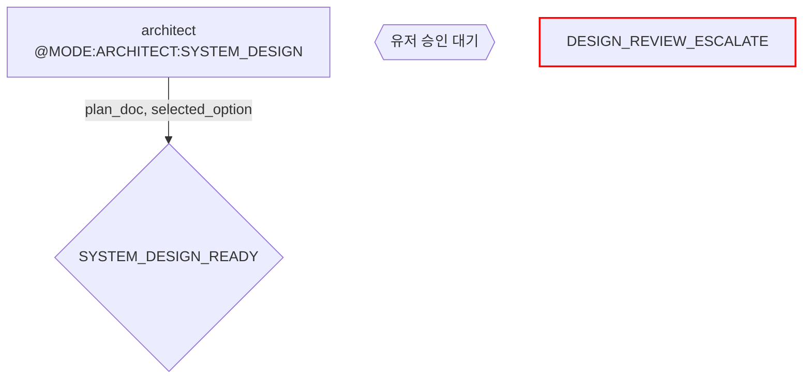

# Task: 오케스트레이션 루프 현행화

에이전트 파일의 @PARAMS/@OUTPUT 스키마를 기준으로 오케스트레이션 루프 다이어그램을 현행화한다.

## 작업 규칙

1. **ASCII 다이어그램 → Mermaid flowchart로 변환**
2. **Mode A/B/C/D/E/F 레이블 → 서술형 이름** (System Design, Module Plan 등)
3. **엣지 라벨에 @PARAMS/@OUTPUT 표시** — 필수 파라미터만, `?` 선택 파라미터는 노드 주석으로
4. **마커 레퍼런스 표는 유지** — 다이어그램 아래 기존 표 구조 유지, 내용만 동기화
5. **기존 파일 구조 보존** — frontmatter, 진입 조건, depth 표 등 다이어그램 외 내용은 건드리지 않음

## Mermaid 노드 컨벤션

## 참조 에이전트 파일 (스키마 소스)

각 파일의 `### @PARAMS 스키마` 섹션에서 인풋/아웃풋을 읽는다:

- `~/.claude/agents/product-planner.md`
- `~/.claude/agents/architect.md`
- `~/.claude/agents/designer.md`
- `~/.claude/agents/design-critic.md`
- `~/.claude/agents/engineer.md`
- `~/.claude/agents/test-engineer.md`
- `~/.claude/agents/validator.md`
- `~/.claude/agents/pr-reviewer.md`
- `~/.claude/agents/security-reviewer.md`
- `~/.claude/agents/qa.md`

## 성공 기준

### Batch 1 — plan.md + tech-epic.md
- [ ] plan.md: ASCII → Mermaid 변환 완료
- [ ] plan.md: Mode A/B 레이블 제거
- [ ] plan.md: product-planner, architect, validator 노드에 @MODE 표시
- [ ] plan.md: 엣지에 @PARAMS 필수 인풋 표시
- [ ] plan.md: 마커 레퍼런스 표 동기화
- [ ] tech-epic.md: ASCII → Mermaid 변환 완료
- [ ] tech-epic.md: architect, validator 노드에 @MODE 표시
- [ ] tech-epic.md: 엣지에 @PARAMS 필수 인풋 표시
- [ ] tech-epic.md: 마커 레퍼런스 표 동기화
- [ ] git commit

### Batch 2 — impl.md
- [ ] impl.md: ASCII → Mermaid 변환 완료
- [ ] impl.md: depth 분기 (fast/std/deep) Mermaid로 표현
- [ ] impl.md: engineer, test-engineer, validator, pr-reviewer, security-reviewer 노드에 @MODE 표시
- [ ] impl.md: SPEC_GAP 분기 + attempt loop 표현
- [ ] impl.md: 엣지에 @PARAMS 필수 인풋 표시 (fail_type?, fail_context? 는 주석)
- [ ] impl.md: 마커 레퍼런스 표 동기화
- [ ] git commit

### Batch 3 — design.md + bugfix.md
- [ ] design.md: ASCII → Mermaid 변환 완료
- [ ] design.md: designer (DEFAULT/FIGMA/UX_REDESIGN), design-critic 노드에 @MODE 표시
- [ ] design.md: PICK/ITERATE/ESCALATE 분기 표현
- [ ] design.md: 엣지에 @PARAMS 필수 인풋 표시
- [ ] design.md: 마커 레퍼런스 표 동기화
- [ ] bugfix.md: ASCII → Mermaid 변환 완료
- [ ] bugfix.md: Mode F/D/B/C 레이블 제거
- [ ] bugfix.md: qa 4-way 분기 (FUNCTIONAL_BUG/SPEC_ISSUE/DESIGN_ISSUE/KNOWN_ISSUE) 표현
- [ ] bugfix.md: 엣지에 @PARAMS 필수 인풋 표시
- [ ] bugfix.md: 마커 레퍼런스 표 동기화
- [ ] git commit

### Batch 4 — orchestration-rules.md + 교차 검증
- [ ] orchestration-rules.md: 에스컬레이션 마커 표 — validator Mode A/B → 서술형 이름
- [ ] orchestration-rules.md: architect Mode C → SPEC_GAP
- [ ] orchestration-rules.md: 변경 업데이트 표 — architect Mode 추가/변경 → 서술형
- [ ] 교차 검증: `grep -rn 'Mode [A-F][ )(—]' ~/.claude/orchestration/ ~/.claude/orchestration-rules.md` = 0건
- [ ] 교차 검증: 각 루프 마커 레퍼런스 표의 @MODE가 에이전트 파일 모드 레퍼런스 표와 일치
- [ ] git commit

## 가드레일

### Sign: 에이전트 파일을 수정하지 마라
- 트리거: agents/*.md 파일 Edit/Write 시도
- 지시: 이 태스크는 orchestration/ 파일만 수정한다. 에이전트 스키마가 틀려 보여도 수정 금지 — 별도 태스크로 분리.

### Sign: Mermaid 문법 검증
- 트리거: Mermaid 코드블록 작성 후
- 지시: 노드 ID에 특수문자 금지 (영문+숫자+언더스코어만). 한국어는 라벨 `["텍스트"]` 안에만.

### Sign: 마커 레퍼런스 표 삭제 금지
- 트리거: 마커 레퍼런스 섹션 변경 시
- 지시: 기존 인풋/아웃풋 마커 표 구조를 유지한다. 내용만 동기화. 섹션 자체를 삭제하거나 다이어그램으로 대체하지 않는다.

### Sign: 다이어그램 밖 내용 보존
- 트리거: 루프 파일 수정 시
- 지시: 진입 조건, depth 표, 재진입 감지, 실패 유형별 전략 등 다이어그램 외 섹션은 그대로 둔다. ASCII 코드블록만 Mermaid로 교체.
