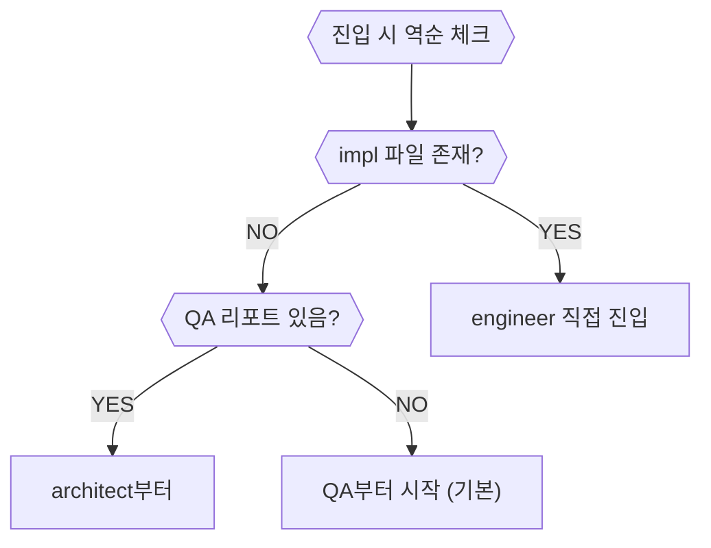
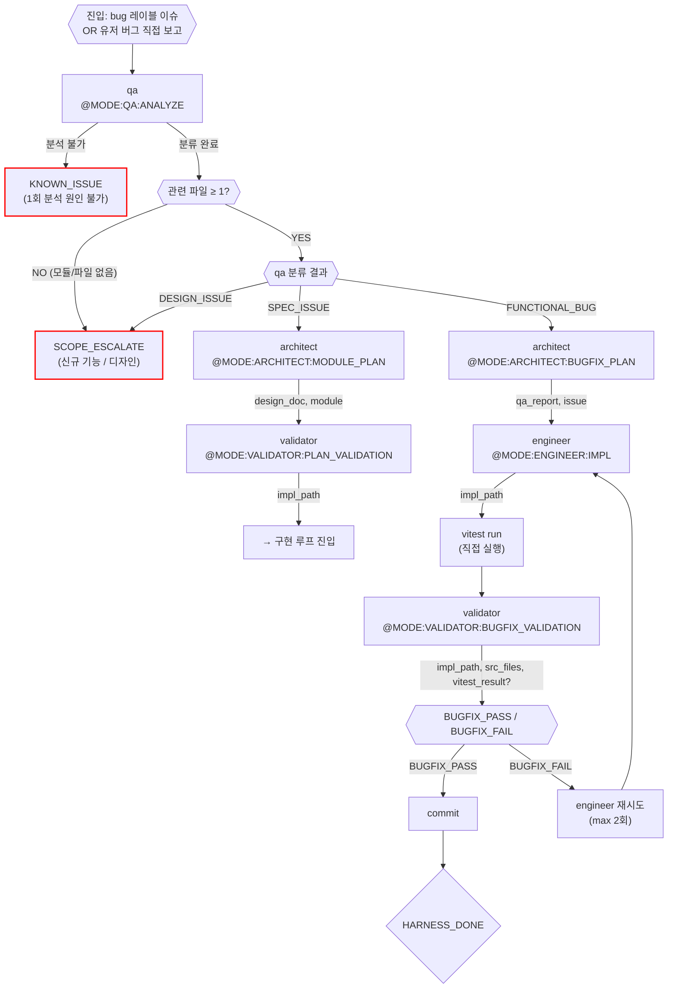

# 버그픽스 루프 (Bugfix)

진입 조건: 버그 보고

---

## 재진입 상태 감지

버그픽스 루프 재진입 시 이전 실행의 완료 단계를 감지해 스킵한다.

## 흐름

## qa 분류 → 분기 매핑

| qa 분류 | 조건 | 경로 | 실행 단계 |
|---------|------|------|----------|
| FUNCTIONAL_BUG | 관련 파일 ≥ 1 | engineer 직접 | architect Bugfix Plan → engineer → vitest → validator Bugfix Validation → commit |
| SPEC_ISSUE | 관련 파일 ≥ 1 | architect 경유 | architect Module Plan → validator Plan Validation → 구현 루프 |
| DESIGN_ISSUE | 관련 파일 ≥ 1 | → 디자인 루프 | designer → design-critic → engineer |
| any | 관련 모듈/파일 = 0 | **SCOPE_ESCALATE** | 메인 Claude 보고 후 대기 |

## severity → depth 연동

| SEVERITY | depth |
|----------|-------|
| HIGH | `std` 강제 (fast 금지) |
| MEDIUM / LOW | 기존 로직 (TYPE + AFFECTED_FILES 기반) |

## 하네스 경유 qa 동작

- 하네스에서 `_agent_call`로 호출 시 **역질문 금지** — QA 출력이 파일로 수집되므로 역질문이 무의미. 가용 정보로 즉시 판단.
- `--issue`로 기존 이슈가 전달된 경우 **신규 이슈 생성 스킵** — 기존 이슈에 분석 결과만 기록.

## qa 이슈 등록 규칙

QA는 **Bugs 마일스톤에만** 이슈를 생성한다. Feature 마일스톤 이슈 생성 권한 없음.

| qa 분류 | 이슈 생성 | 비고 |
|---------|----------|------|
| FUNCTIONAL_BUG (관련 파일 ≥ 1) | Bugs 마일스톤 (라벨: `bug`) | 코드 버그 |
| SPEC_ISSUE (관련 파일 ≥ 1) | Bugs 마일스톤 (라벨: `bug`, `spec-gap`) | 구현 누락 = 코드 결함으로 취급 |
| DESIGN_ISSUE (관련 파일 ≥ 1) | Bugs 마일스톤 (라벨: `bug`, `design-fix`) | UI 결함 (폰트, 문구, 레이아웃 등) |
| any (관련 모듈/파일 = 0) | **생성 금지** → SCOPE_ESCALATE | 신규 기능은 QA 범위 초과 |
| DUPLICATE_OF / 기존 issue 전달 | **생성 금지** | 중복 방지 |

---

## 마커 레퍼런스

### 인풋 마커 (이 루프에서 호출하는 @MODE)

| @MODE | 대상 에이전트 | 호출 시점 |
|---|---|---|
| `@MODE:QA:ANALYZE` | qa | 버그 접수 → 원인 분석 + 분류 |
| `@MODE:ARCHITECT:BUGFIX_PLAN` | architect | FUNCTIONAL_BUG → 경량 impl 작성 |
| `@MODE:ARCHITECT:MODULE_PLAN` | architect | SPEC_ISSUE → 구현 루프 경유 |
| `@MODE:ENGINEER:IMPL` | engineer | 코드 수정 |
| `@MODE:VALIDATOR:BUGFIX_VALIDATION` | validator | engineer 직접 경로 후 검증 |
| `@MODE:VALIDATOR:PLAN_VALIDATION` | validator | SPEC_ISSUE 경로 impl 검증 |

### 아웃풋 마커 (이 루프에서 발생하는 시그널)

| 마커 | 발행 주체 | 다음 행동 |
|------|-----------|-----------|
| `FUNCTIONAL_BUG` | qa | architect Bugfix Plan → engineer 직접 |
| `SPEC_ISSUE` | qa | architect Module Plan → 구현 루프 |
| `DESIGN_ISSUE` | qa | → 디자인 루프 (관련 파일 ≥ 1일 때) |
| `SCOPE_ESCALATE` | qa (관련 모듈/파일 = 0) | 메인 Claude 보고 후 대기 — product-planner 라우팅 |
| `KNOWN_ISSUE` | qa (1회 분석으로 원인 특정 불가) | 메인 Claude 보고 후 대기 |
| `BUGFIX_PLAN_READY` | architect | engineer 코드 수정 |
| `BUGFIX_PASS` | validator | commit → HARNESS_DONE |
| `BUGFIX_FAIL` | validator | engineer 재시도 (max 2회) |
| `HARNESS_DONE` | harness | 메인 Claude 보고 |
