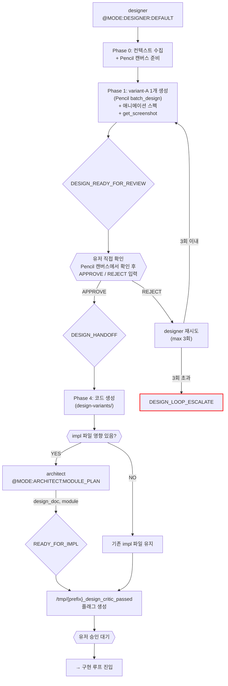
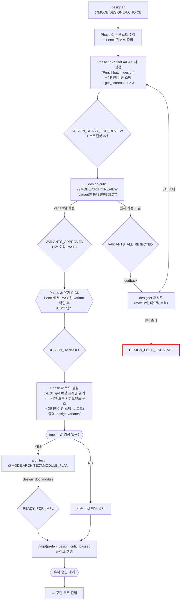

# 디자인 루프 (Design) — v3 Pencil MCP 기반

진입 조건: impl 파일에 UI 키워드 감지 + design_critic_passed 없음

---

## 모드 선택

| 모드 | 진입 플래그 | 시안 수 | 크리틱 |
|---|---|---|---|
| **DEFAULT** | (미지정, 기본값) | 1 variant | 없음 — 유저 직접 확인 |
| **CHOICE** | `--choice` | 3 variants | PASS/REJECT per variant → 유저 PICK |
| **UX_REDESIGN** | `--ux-redesign` | 5→3 → variant A/B/C | UX_SHORTLIST 경유 |

---

## DEFAULT 모드 흐름 (1 variant, 크리틱 없음)

---

## CHOICE 모드 흐름 (3 variants, 크리틱 PASS/REJECT)

---

## 마커 레퍼런스

### 인풋 마커 (이 루프에서 호출하는 @MODE)

| @MODE | 대상 에이전트 | 호출 시점 |
|---|---|---|
| `@MODE:DESIGNER:DEFAULT` | designer | Pencil MCP 기반 1 variant 생성 (기본값) |
| `@MODE:DESIGNER:CHOICE` | designer | --choice 플래그 시 3 variant 생성 |
| `@MODE:DESIGNER:UX_REDESIGN` | designer | UX 전면 개편 요청 시 |
| `@MODE:CRITIC:REVIEW` | design-critic | CHOICE 모드 — 3 variant PASS/REJECT 심사 |
| `@MODE:CRITIC:UX_SHORTLIST` | design-critic | UX 개편 5→3 선별 |
| `@MODE:ARCHITECT:MODULE_PLAN` | architect | DESIGN_HANDOFF 후 impl 영향 있을 때 |

### 아웃풋 마커 (이 루프에서 발생하는 시그널)

| 마커 | 발행 주체 | 다음 행동 |
|------|-----------|-----------|
| `DESIGN_READY_FOR_REVIEW` | designer | DEFAULT: 유저 직접 확인 / CHOICE: design-critic 호출 |
| `VARIANTS_APPROVED` | design-critic (CHOICE) | 1개 이상 PASS — Phase 3 유저 PICK 안내 |
| `VARIANTS_ALL_REJECTED` | design-critic (CHOICE) | 전체 REJECT — designer 재시도 (max 3회, 피드백 누적) |
| `UX_REDESIGN_SHORTLIST` | design-critic | 3개 선별 → Phase 1 variant 생성 |
| `DESIGN_LOOP_ESCALATE` | designer (3회 초과) | 유저 직접 선택 |
| `DESIGN_HANDOFF` | designer Phase 4 (유저 선택 후) | architect Module Plan (영향 시) → 구현 루프 |

---

## 의존성

- **Pencil.dev** 설치 필요 (VS Code 확장 또는 데스크톱 앱)
- **Pencil MCP 서버** 활성화 필요
- 사용 MCP 도구: `batch_design`, `batch_get`, `get_screenshot`, `get_editor_state`
- 추가 비용: $0 (Pencil.dev 얼리 액세스 무료)
