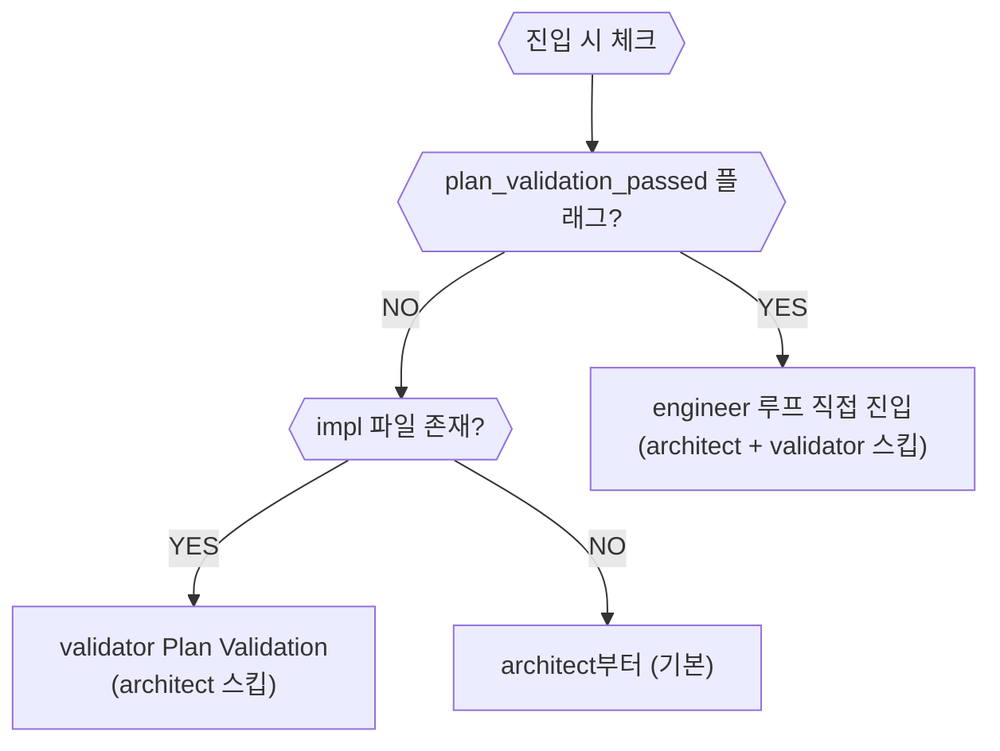
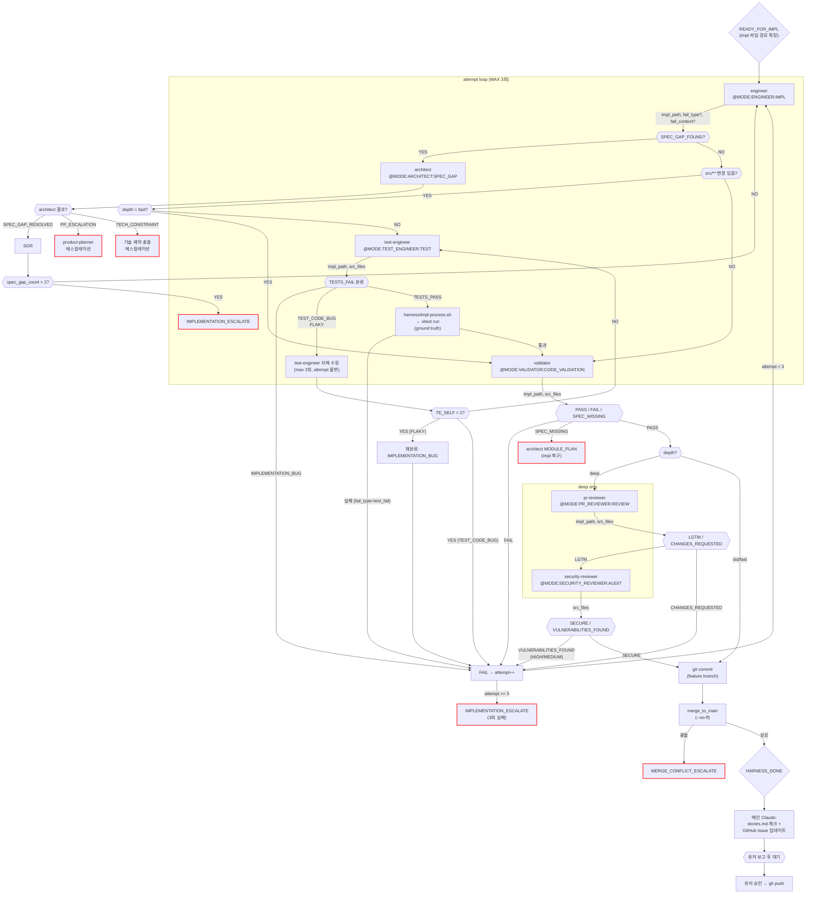

# 구현 루프 (Impl)

진입 조건: READY_FOR_IMPL 또는 plan_validation_passed

---

## depth (루프 깊이)

| depth | 실행 단계 | 사용 조건 | 머지 조건 |
|---|---|---|---|
| `fast` | engineer → validator → commit → merge (LLM 2회, 테스트·보안·리뷰 스킵) | impl에 `(MANUAL)` 태그만 있을 때 / 변수명·설정값 등 단순 변경 | 없음 |
| `std` | engineer → test-engineer → vitest → validator → commit → merge (LLM 3회) | 일반 구현 (기본값) | validator_b_passed |
| `deep` | engineer → test-engineer → vitest → validator → pr-reviewer → security-reviewer → commit → merge (LLM 5회) | impl에 `(BROWSER:DOM)` 태그 있을 때, 또는 보안·품질 게이트 필요 시 | pr_reviewer_lgtm + security_review_passed |

자동 선택 규칙 (`--depth` 미지정 시):
- impl 파일에 `(MANUAL)` 태그만 있고 `(TEST)` `(BROWSER:DOM)` 없음 → `fast` 자동
- impl 파일에 `(BROWSER:DOM)` 태그 있음 → `deep` 자동
- 그 외 → `std`

---

## 재진입 상태 감지

구현 루프 재진입 시 이전 실행의 완료 단계를 감지해 스킵한다.

## 흐름

## 실패 유형별 수정 전략

FAIL 시 모든 유형을 동일하게 처리하지 않는다. `fail_type`에 따라 engineer에게 다른 컨텍스트와 지시를 전달한다.

| fail_type | 컨텍스트 (engineer에게 전달) | 지시 |
|---|---|---|
| `test_fail` | vitest 출력 전체 + 실패 테스트 파일 소스 | "테스트 실패. 구현 코드를 수정. 테스트 자체 수정 금지." |
| `validator_fail` | validator 리포트 + impl 파일 | "스펙 불일치. impl의 해당 항목 재확인 후 누락 구현." |
| `pr_fail` | MUST FIX 항목 목록 | "코드 품질 이슈. MUST FIX 항목만 수정. 기능 변경 금지." |
| `security_fail` | 취약점 리포트 (HIGH/MEDIUM 행) | "보안 취약점. 수정 방안 컬럼대로 적용." |

---

## 마커 레퍼런스

### 인풋 마커 (이 루프에서 호출하는 @MODE)

| @MODE | 대상 에이전트 | 호출 시점 |
|---|---|---|
| `@MODE:ENGINEER:IMPL` | engineer | 코드 구현 (초회 + 재시도) |
| `@MODE:TEST_ENGINEER:TEST` | test-engineer | src/** 변경 후 테스트 작성 |
| `@MODE:VALIDATOR:CODE_VALIDATION` | validator | 테스트 통과 후 코드 검증 |
| `@MODE:PR_REVIEWER:REVIEW` | pr-reviewer | [deep only] 코드 품질 리뷰 |
| `@MODE:SECURITY_REVIEWER:AUDIT` | security-reviewer | [deep only] 보안 감사 |
| `@MODE:ARCHITECT:SPEC_GAP` | architect | SPEC_GAP_FOUND 수신 시 |

### 아웃풋 마커 (이 루프에서 발생하는 시그널)

| 마커 | 발행 주체 | 다음 행동 |
|------|-----------|-----------|
| `SPEC_GAP_FOUND` | engineer | architect SPEC_GAP → attempt 동결 (spec_gap_count 별도) |
| `SPEC_GAP_RESOLVED` | architect | engineer 재시도 |
| `PRODUCT_PLANNER_ESCALATION_NEEDED` | architect | product-planner 에스컬레이션 |
| `TECH_CONSTRAINT_CONFLICT` | architect | 메인 Claude 보고 — 기술 제약 충돌 |
| `TESTS_PASS` | test-engineer | vitest run (ground truth) |
| `TESTS_FAIL` | test-engineer | 분류별 처리 (IMPLEMENTATION_BUG/TEST_CODE_BUG/FLAKY) |
| `PASS` | validator | pr-reviewer (deep) 또는 commit (std) |
| `FAIL` | validator | engineer 재시도 |
| `SPEC_MISSING` | validator | architect MODULE_PLAN (impl 복구) |
| `LGTM` | pr-reviewer | security-reviewer |
| `CHANGES_REQUESTED` | pr-reviewer | engineer 재시도 |
| `SECURE` | security-reviewer | commit |
| `VULNERABILITIES_FOUND` | security-reviewer | engineer 재시도 (HIGH/MEDIUM) |
| `IMPLEMENTATION_ESCALATE` | harness (3회 실패) | 메인 Claude 보고 |
| `MERGE_CONFLICT_ESCALATE` | harness (merge 충돌) | 메인 Claude 보고 |
| `HARNESS_DONE` | harness (commit 성공) | stories.md 체크 → 유저 보고 |
