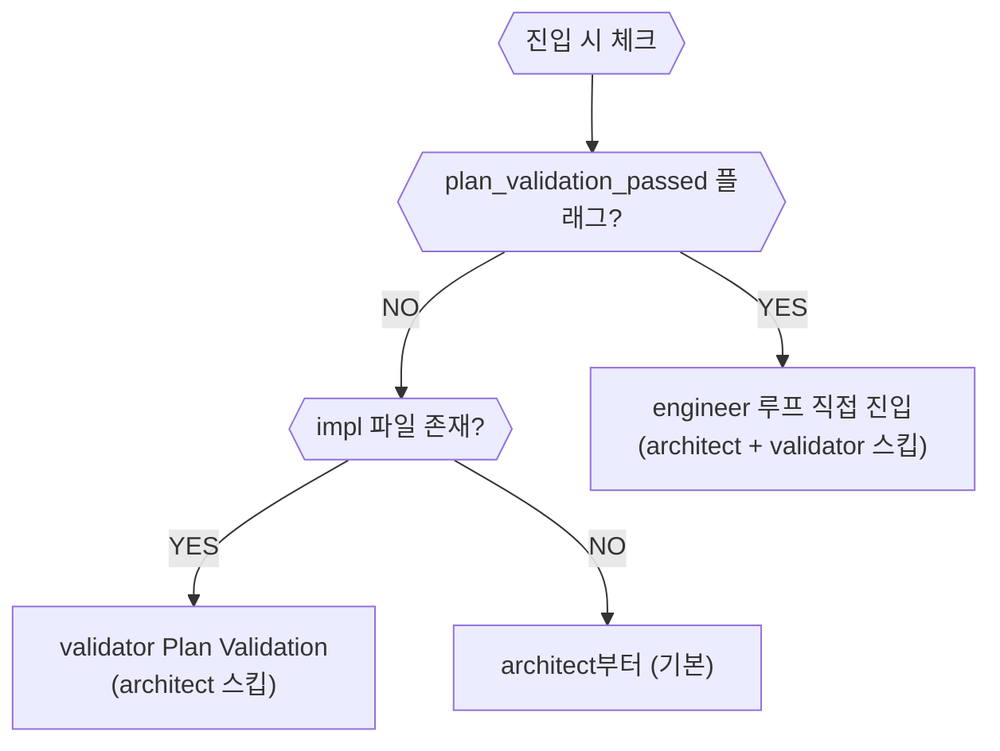

# 구현 루프 개요 (Impl)

진입 조건: `READY_FOR_IMPL` 또는 `plan_validation_passed`

---

## depth 선택 기준

| depth | 진입 조건 | 상세 문서 |
|---|---|---|
| `fast` | impl에 `(MANUAL)` 태그만 있을 때 / 단순 변경 | [impl_fast.md](impl_fast.md) |
| `std` | 일반 구현 (기본값) | [impl_std.md](impl_std.md) |
| `deep` | impl에 `(BROWSER:DOM)` 태그 있을 때 / 보안·품질 게이트 필요 시 | [impl_deep.md](impl_deep.md) |
| `direct` | impl 파일 없이 GitHub 이슈 컨텍스트로 직행 (QA/DESIGN_HANDOFF) | [impl_direct.md](impl_direct.md) |

### 자동 선택 규칙 (`--depth` 미지정 시)

- impl 파일에 `(MANUAL)` 태그만 있고 `(TEST)` `(BROWSER:DOM)` 없음 → `fast`
- impl 파일에 `(BROWSER:DOM)` 태그 있음 → `deep`
- 그 외 → `std`

---

## 재진입 상태 감지

구현 루프 재진입 시 이전 실행의 완료 단계를 감지해 스킵한다.



---

## 호출 형식

```bash
bash ~/.claude/harness/executor.sh impl \
  --impl <impl_file_path> \
  --issue <issue_number> \
  [--prefix <prefix>] \
  [--depth fast|std|deep]

# direct 모드 (impl 파일 없음)
bash ~/.claude/harness/executor.sh direct --issue <N> [--prefix <P>]
```
