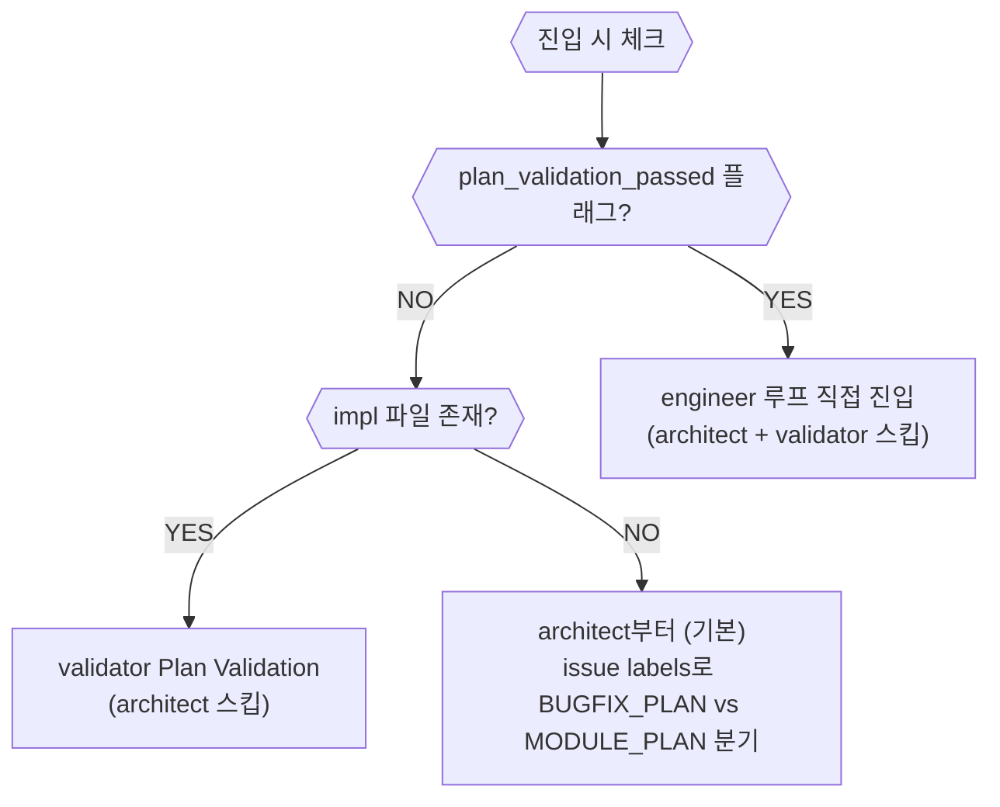

# 구현 루프 개요 (Impl)

진입 조건: `READY_FOR_IMPL` 또는 `plan_validation_passed`

---

## depth 선택 기준

depth는 architect가 impl 파일 frontmatter `depth:` 필드로 선언한다.
태그(`(MANUAL)`/`(BROWSER:DOM)`)를 grep해서 판단하는 방식은 폐기됨.

| depth | 기준 | 상세 문서 |
|---|---|---|
| `simple` | behavior 불변 — 이름·텍스트·스타일·설정값·번역 (파일 수 무관) | [impl_simple.md](impl_simple.md) |
| `std` | behavior 변경 — 로직·API·DB·컴포넌트 동작 (기본값) | [impl_std.md](impl_std.md) |
| `deep` | behavior 변경 + 보안 민감 — auth·결제·암호화·토큰·외부 보안 API | [impl_deep.md](impl_deep.md) |

### 자동 선택 규칙 (`--depth` 미지정 시)

impl 파일의 YAML frontmatter에서 `depth:` 필드를 읽는다:
- `depth: simple` → `simple`
- `depth: std` → `std`
- `depth: deep` → `deep`
- frontmatter 없음 또는 유효하지 않은 값 → `std` (기본값)

---

## QA / DESIGN_HANDOFF 진입 흐름 (기존 direct 대체)

impl 파일 없이 issue 번호만으로 진입하는 경우:

```
qa 스킬 → QA 에이전트 (이슈 생성 #N)
→ executor.sh impl --issue <N>  (--impl 없이)
→ impl.sh: impl 파일 없음 감지
  → pre-analysis (suspected_files: issue 키워드 grep 상위 10개, issue_summary, labels)
  → architect BUGFIX_PLAN (suspected_files + issue_summary + labels 전달)
    → impl 파일 생성 (frontmatter depth: simple|std|deep 선언)
  → plan_validation
  → simple / std / deep 루프
```

ux 스킬 DESIGN_HANDOFF도 동일한 흐름:
```
ux 스킬 → designer → DESIGN_HANDOFF → GitHub 이슈 생성 (#N)
→ 유저 확인 → executor.sh impl --issue <N>
```

---

## 재진입 상태 감지

구현 루프 재진입 시 이전 실행의 완료 단계를 감지해 스킵한다.



---

## 호출 형식

```bash
bash ~/.claude/harness/executor.sh impl \
  --impl <impl_file_path> \
  --issue <issue_number> \
  [--prefix <prefix>] \
  [--depth simple|std|deep]

# impl 파일 없이 (QA/DESIGN_HANDOFF): architect가 BUGFIX_PLAN으로 impl 생성
bash ~/.claude/harness/executor.sh impl --issue <N> [--prefix <P>]
```
