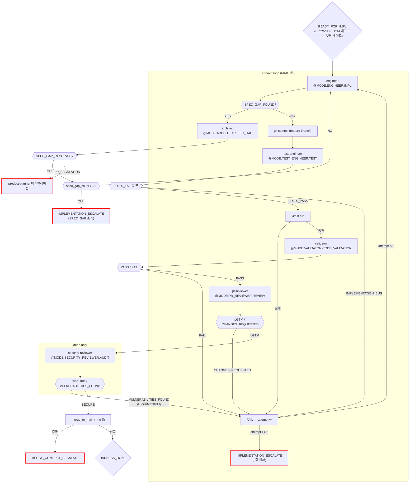

# Deep 구현 루프 (impl_deep)

진입 조건: impl frontmatter `depth: deep` — behavior 변경 + 보안 민감
스크립트: `harness/impl_deep.sh`

---

## 특징

- **LLM 호출**: 5회 (engineer + test-engineer + validator + pr-reviewer + security-reviewer)
- **std와의 차이**: pr-reviewer LGTM 이후 security-reviewer 추가 실행
- **머지 조건**: `pr_reviewer_lgtm` + `security_review_passed`

---

## 흐름

impl_std와 동일한 흐름에서 pr-reviewer LGTM 이후 security-reviewer가 추가된다.

---

## 실패 유형별 수정 전략

| fail_type | 컨텍스트 (engineer에게 전달) | 지시 |
|---|---|---|
| `test_fail` | vitest 출력 전체 + 실패 테스트 파일 소스 | "테스트 실패. 구현 코드를 수정. 테스트 자체 수정 금지." |
| `validator_fail` | validator 리포트 + impl 파일 | "스펙 불일치. impl의 해당 항목 재확인 후 누락 구현." |
| `pr_fail` | MUST FIX 항목 목록 | "코드 품질 이슈. MUST FIX 항목만 수정. 기능 변경 금지." |
| `security_fail` | 취약점 리포트 (HIGH/MEDIUM 행) | "보안 취약점. 수정 방안 컬럼대로 적용." |

---

## 마커 레퍼런스

### 인풋 마커

| @MODE | 대상 에이전트 | 호출 시점 |
|---|---|---|
| `@MODE:ENGINEER:IMPL` | engineer | 코드 구현 (초회 + 재시도) |
| `@MODE:TEST_ENGINEER:TEST` | test-engineer | src/** 변경 후 |
| `@MODE:VALIDATOR:CODE_VALIDATION` | validator | vitest 통과 후 |
| `@MODE:PR_REVIEWER:REVIEW` | pr-reviewer | validator PASS 후 |
| `@MODE:SECURITY_REVIEWER:AUDIT` | security-reviewer | pr-reviewer LGTM 후 (deep only) |
| `@MODE:ARCHITECT:SPEC_GAP` | architect | SPEC_GAP_FOUND 수신 시 |

### 아웃풋 마커

impl_std 마커 전부 포함하며, 추가로:

| 마커 | 발행 주체 | 다음 행동 |
|------|-----------|-----------|
| `SECURE` | security-reviewer | merge |
| `VULNERABILITIES_FOUND` | security-reviewer | engineer 추가 커밋 후 재시도 (HIGH/MEDIUM) |
