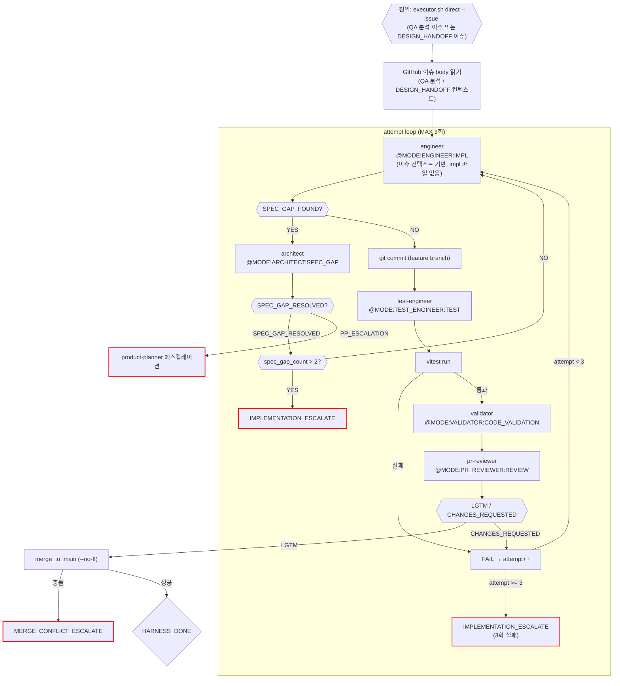

# Direct 구현 루프 (impl_direct)

진입 조건: qa 스킬이 FUNCTIONAL_BUG 분류 + GitHub 이슈 생성 완료 후 호출
또는: ux 스킬 DESIGN_HANDOFF 후 구현 진입 시
스크립트: `harness/impl_direct.sh`

---

## 역할

impl 파일 없이 engineer에게 직행하는 경량 구현 루프.
- QA 분석(GitHub 이슈 body)을 컨텍스트로 engineer에게 전달
- SPEC_GAP_FOUND 발생 시 architect inline 처리
- depth: 항상 `std` 고정 (impl 파일 없으므로 태그 기반 자동 판정 불가)

---

## 흐름



---

## qa 스킬 분류 → direct 루프 진입 흐름

```
qa 스킬
  → QA 에이전트 (Agent 도구 직접 호출)
    → FUNCTIONAL_BUG + GitHub 이슈 생성 (#N)
  → executor.sh direct --issue <N>
```

SPEC_ISSUE 분류는 제거됨. QA가 FUNCTIONAL_BUG로 분류하면 direct 루프가 engineer 직행으로 처리하고,
engineer가 구현 중 스펙 부족을 감지하면 `SPEC_GAP_FOUND` 마커로 architect를 inline 호출한다.

---

## DESIGN_HANDOFF → direct 루프 진입 흐름

```
ux 스킬
  → designer 에이전트 → DESIGN_HANDOFF
  → GitHub 이슈 생성 (#N, 라벨: design-fix)
  → 유저 확인 → executor.sh direct --issue <N>
```

---

## 마커 레퍼런스

### 인풋 마커 (이 루프에서 호출하는 @MODE)

| @MODE | 대상 에이전트 | 호출 시점 |
|---|---|---|
| `@MODE:ENGINEER:IMPL` | engineer | 코드 구현 (초회 + 재시도) |
| `@MODE:TEST_ENGINEER:TEST` | test-engineer | src/** 변경 후 테스트 작성 |
| `@MODE:VALIDATOR:CODE_VALIDATION` | validator | 테스트 통과 후 코드 검증 |
| `@MODE:PR_REVIEWER:REVIEW` | pr-reviewer | validator PASS 후 코드 품질 리뷰 |
| `@MODE:ARCHITECT:SPEC_GAP` | architect | SPEC_GAP_FOUND 수신 시 |

### 아웃풋 마커

| 마커 | 발행 주체 | 다음 행동 |
|------|-----------|-----------|
| `SPEC_GAP_FOUND` | engineer | architect SPEC_GAP → attempt 동결 |
| `SPEC_GAP_RESOLVED` | architect | engineer 재시도 |
| `HARNESS_DONE` | harness (merge 성공) | 유저 보고 |
| `IMPLEMENTATION_ESCALATE` | harness (3회 실패) | 메인 Claude 보고 |
| `MERGE_CONFLICT_ESCALATE` | harness (merge 충돌) | 메인 Claude 보고 |
