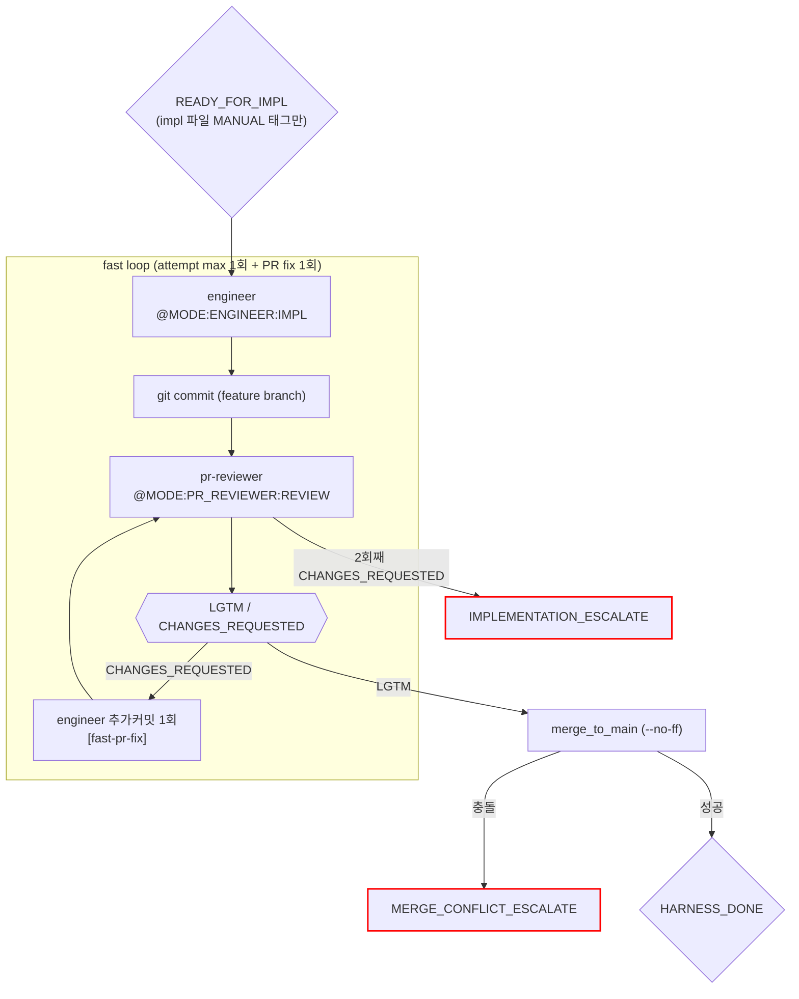

# Fast 구현 루프 (impl_fast)

진입 조건: impl 파일에 `(MANUAL)` 태그만 있고 `(TEST)` `(BROWSER:DOM)` 없을 때
스크립트: `harness/impl_fast.sh`

---

## 특징

- **LLM 호출**: 2회 (engineer + pr-reviewer)
- **테스트·보안 스킵**: test-engineer, vitest, validator, security-reviewer 없음
- **머지 조건**: `pr_reviewer_lgtm`
- **사용 사례**: 변수명·설정값 등 단순 변경, MANUAL 태그만 있는 구현

---

## 흐름

---

## 실패 유형별 수정 전략

| fail_type | 컨텍스트 (engineer에게 전달) | 지시 |
|---|---|---|
| `pr_fail` | MUST FIX 항목 목록 | "코드 품질 이슈. MUST FIX 항목만 수정. 기능 변경 금지." |

---

## 마커 레퍼런스

### 인풋 마커

| @MODE | 대상 에이전트 | 호출 시점 |
|---|---|---|
| `@MODE:ENGINEER:IMPL` | engineer | 코드 구현 |
| `@MODE:PR_REVIEWER:REVIEW` | pr-reviewer | engineer 커밋 후 |

### 아웃풋 마커

| 마커 | 발행 주체 | 다음 행동 |
|------|-----------|-----------|
| `LGTM` | pr-reviewer | merge |
| `CHANGES_REQUESTED` | pr-reviewer | engineer 추가커밋 1회 (fast-pr-fix) |
| `HARNESS_DONE` | harness (merge 성공) | stories.md 체크 → 유저 보고 |
| `IMPLEMENTATION_ESCALATE` | harness (PR fix 후 재CHANGES_REQUESTED) | 메인 Claude 보고 |
| `MERGE_CONFLICT_ESCALATE` | harness (merge 충돌) | 메인 Claude 보고 |
