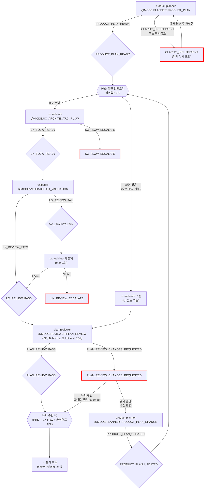

# 기획-UX 루프 (Plan)

진입 조건: 신규 프로젝트 / PRD 변경
종료 게이트: **유저 승인 ①** (PRD + UX Flow + 와이어프레임)

> 이 루프가 끝나면 → [설계 루프](system-design.md)로 진행

---

---

## UI 없는 기능 감지

planner PRD의 화면 인벤토리가 비어있거나 모든 기능에 `(UI 없음)` 표시 → ux-architect 스킵, 설계 루프 직행.

## UX_SYNC 모드 분기

src/ 코드 존재 + ux-flow.md 없음 → `@MODE:UX_ARCHITECT:UX_SYNC` 모드로 호출 (기존 프로젝트 현행화).

## 유저 승인 ① 라우팅

유저 수정 요청 시 메인 Claude가 판단:
- **화면 추가/삭제** → planner(PRODUCT_PLAN_CHANGE) + ux-architect(UX_FLOW) 재실행
- **기존 화면 내 변경** → ux-architect(UX_FLOW)만 재실행
- **비기능 변경** → planner(PRODUCT_PLAN_CHANGE)만 재실행

## plan-reviewer 판단 게이트

validator(UX)가 **형식·완결성**(화면 커버리지, 상태 정의, 수용 기준)을 검사한 후,
plan-reviewer가 **판단 레벨**(현실성, MVP 균형, 제약 정합, UX 저니 자연스러움, 숨은 가정)을 리뷰한다.

- UI가 있으면 validator(UX) PASS 이후, UX_SKIP 케이스에서는 PRD 직후에 호출.
- `PLAN_REVIEW_PASS` → 유저 승인 ① 게이트로 진행.
- `PLAN_REVIEW_CHANGES_REQUESTED` → 하네스 루프는 종료하고 메인 Claude가 피드백을 유저에게 **원문 그대로** 전달. 유저가 결정:
  - "수정 반영" → 라우팅에 따라 planner(PRODUCT_PLAN_CHANGE)·ux-architect 재실행 (체크포인트 리셋 규칙 동일 적용)
  - "그대로 진행 (override)" → 스킬이 override 플래그 기록 후 plan 루프 재실행 → reviewer 스킵 → UX_REVIEW_PASS 리턴

**중요**: plan-reviewer는 기획 본문을 수정하지 않는다. 제안 방향만 1~2줄로 제시. 실제 수정은 product-planner/ux-architect가 담당.

## 체크포인트

| 산출물 | 존재 시 스킵 |
|--------|-------------|
| `prd.md` | product-planner 스킵 |
| `docs/ux-flow.md` | ux-architect 스킵 |

상태는 `{prefix}_plan_metadata.json`에 저장.

---

## 마커 레퍼런스

### 인풋 마커

| @MODE | 대상 에이전트 | 호출 시점 |
|---|---|---|
| `@MODE:PLANNER:PRODUCT_PLAN` | product-planner | 신규 기획 시작 |
| `@MODE:PLANNER:PRODUCT_PLAN_CHANGE` | product-planner | 기존 PRD 변경 |
| `@MODE:UX_ARCHITECT:UX_FLOW` | ux-architect | PRODUCT_PLAN_READY 후 UX 설계 |
| `@MODE:UX_ARCHITECT:UX_SYNC` | ux-architect | 기존 프로젝트 현행화 |
| `@MODE:VALIDATOR:UX_VALIDATION` | validator | UX_FLOW_READY 후 UX 검증 |
| `@MODE:REVIEWER:PLAN_REVIEW` | plan-reviewer | UX Validation PASS 후(또는 UX_SKIP 시 PRD 직후) 판단 게이트 |

### 아웃풋 마커

| 마커 | 발행 주체 | 다음 행동 |
|------|-----------|-----------|
| `PRODUCT_PLAN_READY` | product-planner | UI 여부 판단 → ux-architect 호출 or 스킵 |
| `PRODUCT_PLAN_UPDATED` | product-planner | 메인 Claude 범위 판단 → 라우팅 |
| `CLARITY_INSUFFICIENT` | product-planner | 유저에게 부족 항목 질문 → 답변 후 재실행 |
| `UX_FLOW_READY` | ux-architect | validator UX Validation |
| `UX_FLOW_ESCALATE` | ux-architect | 메인 Claude 보고 — planner 재호출 또는 유저 판단 |
| `UX_REVIEW_PASS` | validator | plan-reviewer 판단 게이트 |
| `UX_REVIEW_FAIL` | validator | ux-architect 재설계 (max 1회) |
| `UX_REVIEW_ESCALATE` | validator | 메인 Claude 보고 후 대기 |
| `PLAN_REVIEW_PASS` | plan-reviewer | 유저 승인 ① 게이트 |
| `PLAN_REVIEW_CHANGES_REQUESTED` | plan-reviewer | 메인 Claude 보고 — 유저 결정(수정 반영 / 그대로 진행 / 취소) |
