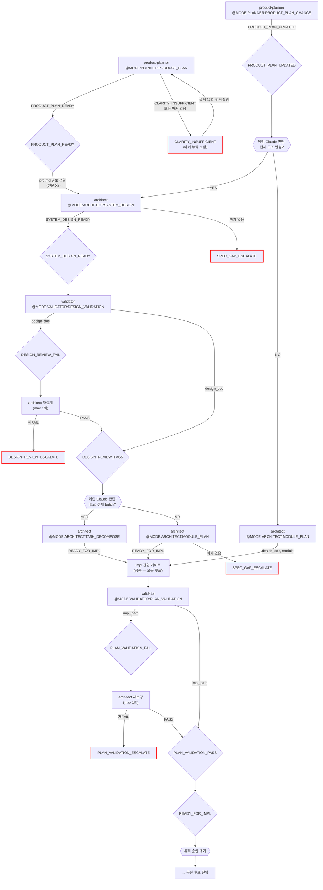

# 기획 루프 (Plan)

진입 조건: 신규 프로젝트 / PRD 변경

---

---

## 마커 레퍼런스

### 인풋 마커 (이 루프에서 호출하는 @MODE)

| @MODE | 대상 에이전트 | 호출 시점 |
|---|---|---|
| `@MODE:PLANNER:PRODUCT_PLAN` | product-planner | 신규 기획 시작 |
| `@MODE:PLANNER:PRODUCT_PLAN_CHANGE` | product-planner | 기존 PRD 변경 |
| `@MODE:ARCHITECT:SYSTEM_DESIGN` | architect | PRODUCT_PLAN_READY 후 전체 구조 설계 |
| `@MODE:ARCHITECT:MODULE_PLAN` | architect | 단일 모듈 impl 작성 (구조 변경 불필요 시) |
| `@MODE:ARCHITECT:TASK_DECOMPOSE` | architect | Epic 전체 batch 분해 |
| `@MODE:VALIDATOR:DESIGN_VALIDATION` | validator | SYSTEM_DESIGN_READY 후 설계 검증 |
| `@MODE:VALIDATOR:PLAN_VALIDATION` | validator | impl 계획 검증 (impl 진입 게이트) |

### 아웃풋 마커 (이 루프에서 발생하는 시그널)

| 마커 | 발행 주체 | 다음 행동 |
|------|-----------|-----------|
| `PRODUCT_PLAN_READY` | product-planner | architect System Design |
| `PRODUCT_PLAN_UPDATED` | product-planner | 메인 Claude 범위 판단 → System Design or Module Plan |
| `CLARITY_INSUFFICIENT` | product-planner (또는 마커 누락 시 자동) | 유저에게 부족 항목 질문 → 답변 후 plan 루프 재실행 |
| `SYSTEM_DESIGN_READY` | architect | validator Design Validation |
| `SPEC_GAP_ESCALATE` | plan_loop (architect 마커 누락 시 자동) | 메인 Claude 보고 후 대기 |
| `PRODUCT_PLANNER_ESCALATION_NEEDED` | architect | product-planner 에스컬레이션 |
| `DESIGN_REVIEW_PASS` | validator | 에픽 규모 판단 → Task Decompose or Module Plan |
| `DESIGN_REVIEW_FAIL` | validator | architect 재설계 (max 1회) |
| `DESIGN_REVIEW_ESCALATE` | validator | 메인 Claude 보고 후 대기 |
| `READY_FOR_IMPL` | architect | impl 진입 게이트 → validator Plan Validation |
| `PLAN_VALIDATION_PASS` | validator | 유저 승인 → 구현 루프 진입 |
| `PLAN_VALIDATION_FAIL` | validator | architect 재보강 (max 1회) |
| `PLAN_VALIDATION_ESCALATE` | validator | 메인 Claude 보고 후 대기 |
