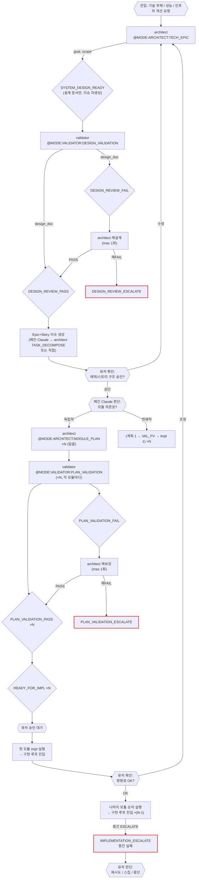

# Tech Epic Loop (기술 에픽 루프) 상세 리뷰

> 작성일: 2026-04-09
> 대상: `orchestration/tech-epic.md`
> 교차 참조: `orchestration-rules.md`, `orchestration/impl.md`, `orchestration/plan.md`, `agents/architect.md`, `agents/validator.md`, `GAP_AUDIT_REPORT.md`
> 방법론: 루프 다이어그램 ↔ 마커 테이블 ↔ 에이전트 정의 ↔ 정책 교차 검증 + 빅테크 벤치마크

---

## 요약

tech-epic 루프는 6개 노드, 5개 마커, 3개 @MODE 호출로 구성된 비교적 간결한 루프다. 그러나 이 간결함이 곧 문제이기도 하다. plan.md와 비교하면 Plan Validation 게이트, 유저 승인 게이트, 실패 처리 경로 등 핵심 안전장치가 빠져 있다. GAP_AUDIT_REPORT의 B-7, B-8, C-1 이슈가 모두 유효하며, 추가로 5건의 신규 갭과 3건의 비효율/개선안을 발견했다.

**위험도 요약:**

| 분류 | 건수 | 심각도 |
|------|------|--------|
| GAP (누락) | 6 | 높음 |
| INCONSISTENCY (불일치) | 3 | 높음 |
| INEFFICIENCY (비효율) | 2 | 중간 |
| IMPROVEMENT (개선제안) | 4 | 중간~낮음 |

---

## 갭/불일치 분석

### G-1. [GAP] Plan Validation 없이 impl 진입 (GAP_AUDIT B-7 확인)

**현상**: `ARC_MP ×N → RFI ×N → SEQ → IMPL_ENTRY` 경로에서 validator Plan Validation이 없다.

**비교**:
- plan.md (EPIC=NO 경로): `ARC_MP → IMPL_GATE → VAL_PV → PVP → RFI`
- plan.md (EPIC=YES 경로): `ARC_TD → IMPL_GATE → VAL_PV → PVP → RFI`
- tech-epic.md: `ARC_MP → RFI` (VAL_PV 없음)

**GAP_AUDIT 주석의 "impl 재진입 감지에서 암묵적으로 처리될 수 있음"에 대한 분석:**
impl.md의 재진입 감지 로직(`RE_IMPL → YES → VAL_PV`)은 `plan_validation_passed` 플래그가 없을 때 VAL_PV를 수행한다. 이는 **단일 impl 진입** 시에만 동작하는 구조다. tech-epic의 `×N 순차 실행`에서는 각 impl마다 impl 루프를 재진입하므로, 이론적으로는 매 진입마다 VAL_PV가 트리거된다.

**그러나 이것은 설계 의도가 아니라 우연의 일치다:**
1. tech-epic 다이어그램에 VAL_PV가 명시되지 않아 이 동작이 보장되는지 불명확
2. impl.md의 재진입 감지는 "이전 실행의 완료 단계를 감지해 스킵"하는 것이 목적이지, 외부 루프의 검증을 대신하는 것이 목적이 아님
3. 하네스 스크립트가 N개 모듈을 순차 실행할 때 `plan_validation_passed` 플래그를 언제 리셋하는지 미정의

**수정 제안**: tech-epic 다이어그램에 `ARC_MP → VAL_PV → RFI` 경로를 명시적으로 추가. 각 모듈마다 VAL_PV를 수행하는 것이 맞다면 `ARC_MP ×N → [VAL_PV → RFI] ×N` 형태로 명시.

---

### G-2. [GAP] 순차 실행(xN) 중 실패 처리 미정의 (GAP_AUDIT B-8 확인)

**현상**: SEQ 노드가 N개 impl을 순차 실행하지만, 중간 모듈에서 IMPLEMENTATION_ESCALATE가 발생했을 때의 전략이 없다.

**가능한 전략과 트레이드오프:**

| 전략 | 장점 | 단점 |
|------|------|------|
| A. 전체 중단 (fail-fast) | 단순, 일관된 코드베이스 유지 | 독립적인 모듈까지 불필요하게 중단 |
| B. 실패 건 스킵 + 나머지 계속 | 최대 진행률 | 모듈 간 의존성이 있으면 후속 모듈도 실패 가능 |
| C. 의존성 그래프 기반 선택적 중단 | 가장 정확 | 모듈 간 의존성 정보가 현재 없음 |

**수정 제안**: 기본 전략으로 **A. fail-fast**를 채택하되, 다이어그램에 다음을 추가:

```
SEQ -->|"IMPLEMENTATION_ESCALATE 발생"| SEQ_HALT["전체 중단\n완료된 모듈: 커밋 보존\n미실행 모듈: 대기"]
SEQ_HALT --> USER_DECISION{{"유저 판단:\n1. 실패 모듈 재시도\n2. 스킵 후 계속\n3. 전체 중단"}}
```

이유: 기술 에픽은 성격상 모듈 간 의존성이 높다 (리팩토링, DB 마이그레이션 등). 독립 모듈이라면 애초에 별도 에픽으로 분리하는 것이 맞다.

---

### G-3. [GAP] ISSUES 노드의 실행 주체/방법 미정의

**현상**: `DRP → ISSUES["Epic+Story 이슈 생성"] → ARC_MP` 경로에서 ISSUES 노드가 에이전트도 @MODE도 없는 빈 박스다.

**분석**: architect의 TECH_EPIC 모드 상세(`agents/architect/tech-epic.md`)를 보면, `@OUTPUT`에 `stories_doc`과 `updated_files: ["backlog.md", "CLAUDE.md"]`가 포함되어 있다. 작업 순서 2번에 "에픽 등록"이 있다. 즉, **architect TECH_EPIC이 이미 에픽/스토리 생성을 수행한다.**

그렇다면 ISSUES 노드는 architect TECH_EPIC의 아웃풋으로 이미 완료된 상태여야 한다. 이것이 맞다면 두 가지 문제가 있다:

1. **흐름 순서 모순**: 다이어그램에서 `ARC_TE → SDR → VAL_DV → DRP → ISSUES → ARC_MP` 순서인데, architect TECH_EPIC(@ARC_TE)이 이미 stories를 만든다면 ISSUES 노드가 DESIGN_REVIEW_PASS 이후에 올 이유가 없다. 설계 검증 전에 이슈가 만들어지는 것이다.
2. **대안 해석**: architect TECH_EPIC이 설계 문서만 만들고 이슈는 나중에 만든다면, ISSUES의 주체가 누구인지 명시 필요. 메인 Claude가 직접? architect를 다시 호출?

**수정 제안**: 두 가지 중 하나:
- (A) architect TECH_EPIC의 @OUTPUT에서 stories_doc을 제거하고, ISSUES 노드를 별도 에이전트 호출로 명시 (예: `architect @MODE:ARCHITECT:TASK_DECOMPOSE` 또는 메인 Claude 직접)
- (B) architect TECH_EPIC이 설계 + 이슈 생성까지 수행한다면, ISSUES 노드를 ARC_TE 아웃풋의 일부로 병합하고 다이어그램 정리. 단, 설계 검증 실패 시 이미 생성된 이슈 처리 방안도 필요.

**권장: (A)**. 설계 검증 전에 이슈를 만들면 FAIL 시 이슈 정리가 필요해 불필요한 복잡성이 생긴다. Google 설계 리뷰 프로세스에서도 design doc 승인 후에야 작업 항목(Buganizer tasks)을 생성한다.

---

### G-4. [GAP] ISSUES → MODULE_PLAN 사이 유저 게이트 부재

**현상**: `DRP → ISSUES → ARC_MP` 경로에 유저 승인 게이트가 없다.

**정책 3 위반 분석**:
- `READY_FOR_IMPL`: "유저 명시 승인 전 구현 루프 자동 진입 금지" -- tech-epic에서는 RFI 후 유저 게이트 자체가 다이어그램에 없음
- `PLAN_DONE`: "유저 결정 전 다음 단계 진입 금지" -- ISSUES가 plan 결과물이라면 해당될 수 있으나 PLAN_DONE 마커가 어디서도 사용 안 됨 (GAP_AUDIT A-6)

**리스크**: N개 모듈의 impl 계획이 자동 생성되면 architect LLM 비용이 N회 발생. 유저가 에픽/스토리 구조를 확인하고 조정할 기회가 없다.

**수정 제안**: ISSUES와 ARC_MP 사이에 유저 게이트 추가:

```
ISSUES --> USER_PLAN_GATE{{"유저 확인:\n에픽/스토리 구조 승인?"}}
USER_PLAN_GATE -->|승인| ARC_MP
USER_PLAN_GATE -->|수정 요청| ARC_TE_REDO["architect 에픽 재구성"]
```

이유: 기술 에픽은 스코프가 크고 (DB 마이그레이션, 리팩토링 등) 잘못된 방향으로 N개 모듈을 계획하면 비용이 크다. plan.md에서도 `EPIC` 판단은 메인 Claude가 하고, RFI 후에도 `USER_APPROVE`를 거친다.

---

### G-5. [GAP] RFI → SEQ 사이 유저 게이트 부재

**현상**: `RFI ×N → SEQ → IMPL_ENTRY` 경로에 유저 승인이 없다.

plan.md에서는 `PVP → RFI → USER_APPROVE → IMPL_ENTRY`로 유저가 impl 진입을 명시 승인한다. tech-epic에서는 N개 RFI가 나온 뒤 바로 순차 실행에 들어간다.

**정책 3 `READY_FOR_IMPL` 게이트 위반.**

**수정 제안**: `RFI ×N → USER_APPROVE{{"유저 승인 대기"}} → SEQ → IMPL_ENTRY`

---

### G-6. [INCONSISTENCY] Plan Validation 적용 불일치 (GAP_AUDIT C-1 확인 + 보강)

**현상**: 동일한 `@MODE:ARCHITECT:MODULE_PLAN` 호출인데 검증 여부가 루프마다 다르다.

| 루프 | 경로 | VAL_PV |
|------|------|--------|
| plan.md (EPIC=NO) | ARC_MP → IMPL_GATE → VAL_PV | O |
| plan.md (EPIC=YES) | ARC_TD → IMPL_GATE → VAL_PV | O |
| plan.md (SCOPE=NO) | ARC_MP_SKIP → RFI | X |
| tech-epic.md | ARC_MP ×N → RFI | X |
| design.md | ARC_MP → RFI | X |
| bugfix.md (SPEC_ISSUE) | ARC_MP → VAL_PV | O |

**심층 분석**: "plan.md SCOPE=NO 경로"는 구조 변경이 불필요한 소규모 변경이므로 VAL_PV 스킵이 합리적일 수 있다. 그러나 tech-epic은 성격상 대규모 변경(리팩토링, 인프라)이므로 VAL_PV를 스킵할 이유가 없다.

**수정 제안**: tech-epic에서 VAL_PV를 필수로 추가. 의도적 스킵이라면 다이어그램에 `<!-- VAL_PV 스킵 사유: ... -->` 주석 필수.

---

### G-7. [INCONSISTENCY] architect TECH_EPIC @OUTPUT와 다이어그램 흐름 불일치

**현상**:
- `agents/architect.md` @PARAMS: `@MODE:ARCHITECT:TECH_EPIC` → `@OUTPUT: { "marker": "SYSTEM_DESIGN_READY", "stories_doc": "생성된 stories.md 경로", ... }`
- 다이어그램: `ARC_TE → SDR → VAL_DV → DRP → ISSUES → ARC_MP`

architect TECH_EPIC이 `stories_doc`을 이미 출력하는데, 다이어그램에서는 DRP 이후에야 ISSUES(Epic+Story 생성)가 나온다. 이는 G-3과 관련된 불일치이며, 에이전트 정의와 루프 다이어그램이 시퀀스상 모순된다.

**수정 제안**: architect TECH_EPIC의 역할을 명확히 양분:
- Phase 1 (TECH_EPIC): 설계 문서만 작성 → `SYSTEM_DESIGN_READY` (stories_doc 제외)
- Phase 2 (ISSUES 이후): stories/impl 작성 → 별도 모드 또는 TASK_DECOMPOSE 재활용

---

### G-8. [INCONSISTENCY] 수용 기준 메타데이터 감사(정책 8) 다이어그램 미반영

**현상**: orchestration-rules.md 정책 8에 따르면 Plan Validation 이후 수용 기준 메타데이터 감사가 별도로 수행되어야 한다:
```
validator [Plan Validation]
  ↓ PASS
validator [수용 기준 메타데이터 감사]  ← 정책 8 게이트
  ↓ PASS
READY_FOR_IMPL
```

tech-epic에는 Plan Validation 자체가 없으므로 정책 8도 자동 미적용.

**수정 제안**: G-1에서 VAL_PV를 추가하면 validator의 Plan Validation 체크리스트 C섹션(수용 기준 메타데이터 감사)이 자동 포함된다. validator/plan-validation.md에 이미 C섹션이 정의되어 있으므로 별도 노드 추가 불필요 -- VAL_PV 내부에서 통합 처리됨을 확인.

---

## 비효율/과잉 분석

### E-1. [INEFFICIENCY] architect TECH_EPIC과 MODULE_PLAN의 중복 작업

**현상**: architect TECH_EPIC 모드(`agents/architect/tech-epic.md` 작업 순서 4)에서 "필요한 경우 각 스토리에 대응하는 impl 파일 작성 (Module Plan 실행)"이라고 되어 있다. 그런데 다이어그램에서는 TECH_EPIC 이후 별도로 `ARC_MP ×N`을 호출한다.

TECH_EPIC이 이미 impl을 작성한다면 ARC_MP 호출이 중복이다. TECH_EPIC이 impl을 작성하지 않는다면 에이전트 정의의 작업 순서 4가 혼란을 준다.

**수정 제안**: architect TECH_EPIC의 책임을 "설계 문서 + 에픽/스토리 구조"까지로 한정하고, impl 작성은 전적으로 ARC_MP ×N에 위임. `agents/architect/tech-epic.md` 작업 순서 4를 제거하거나 "Module Plan에서 별도 수행"으로 수정.

---

### E-2. [INEFFICIENCY] Design Validation 1회 재시도 + 에스컬레이션의 경직성

**현상**: Design Validation FAIL → architect 재설계 (max 1회) → 재FAIL → DESIGN_REVIEW_ESCALATE.

**빅테크 벤치마크**: Google의 design doc 리뷰는 통상 2~4라운드의 피드백 루프를 거친다. Meta의 design review도 첫 리뷰에서 fundamental concerns가 나오면 rewrite 후 2차 리뷰를 받고, 2차에서 minor nits만 남으면 "LGTM with comments"로 진행한다. 즉 3라운드 정도가 일반적이다.

**그러나**: 이 시스템에서 architect는 LLM이므로 1회 재시도에도 대부분의 피드백을 반영할 수 있다. 인간 엔지니어와 달리 "이해 못 해서 같은 실수 반복"의 확률이 낮다. 문제는 validator도 LLM이라 두 LLM 간 무한 핑퐁이 발생할 수 있다는 점이다.

**결론**: 현재 max 1회(총 2라운드)는 LLM-to-LLM 특성상 합리적이다. 다만, FAIL 항목이 3개 이하이고 모두 "스펙 완결성" 카테고리(B)인 경우에만 2회까지 허용하는 조건부 확장을 고려할 수 있다. 구현 가능성(A)이나 리스크(C) 카테고리 FAIL은 1회에서 에스컬레이션이 맞다 -- 이는 아키텍처 레벨 결함이므로 유저 개입이 필요하다.

**수정 제안**: 현재 구조 유지 + 다이어그램에 주석 추가:
```
ARC_REDO["architect 재설계\n(max 1회)\n※ A/C 카테고리 FAIL은\n즉시 ESCALATE 권장"]
```

---

## 빅테크 벤치마크 기반 개선안

### B-1. [IMPROVEMENT] xN 순차 실행 vs 병렬 실행

**현상**: `SEQ["순차 실행 (×N)"]`으로 N개 모듈을 하나씩 실행.

**빅테크 비교**:
- **Google**: Large-scale refactoring은 Rosie/LSC(Large-Scale Change) 시스템으로 수천 개 CL을 병렬 생성/테스트. 단, 각 CL은 독립적이어야 한다.
- **Meta**: Diff stack으로 의존 관계가 있는 변경도 스택으로 쌓아 병렬 리뷰하되 머지는 순차.

**분석**:

| 관점 | 순차 | 병렬 |
|------|------|------|
| 모듈 간 의존성 | 자연스럽게 해결 (이전 모듈의 결과물 위에 빌드) | 의존성 그래프 필요, 충돌 해결 복잡 |
| LLM 비용 | 동일 (N회) | 동일 (N회) but 동시 실행 불가 (정책 4: 포어그라운드 순차) |
| 피드백 루프 | 이전 모듈 실패의 학습이 후속 모듈에 반영 가능 | 같은 실수를 N개 모듈에서 동시에 범할 수 있음 |
| 중간 검증 | 모듈별 커밋으로 점진적 검증 | 전체 완료 후 통합 테스트 필요 |
| 브랜치 전략 | feature branch 하나에서 커밋 추가 | 모듈별 브랜치 → 머지 순서 관리 필요 |

**결론**: 현재 시스템의 제약(정책 4 포어그라운드 순차, 단일 feature branch)에서 순차 실행이 올바른 선택이다. 병렬 실행은 기술적으로도 불가능하고, LLM 특성상 이전 모듈의 학습 효과가 있다.

**수정 제안**: 변경 불필요. 다만 다이어그램에 순차 실행의 의도를 주석으로 명시:
```
SEQ["순차 실행 (×N)\n이전 모듈 커밋 → 다음 모듈 시작\n(모듈 간 의존성 + 학습 효과)"]
```

---

### B-2. [IMPROVEMENT] N/2 시점 설계 리뷰 체크포인트

**질문**: "N/2 모듈 완료 후 systemic issue를 잡기 위한 중간 체크포인트가 필요한가?"

**빅테크 비교**:
- Google LSC: 대규모 변경에서 10%/50%/100% 게이트를 둠 (canary → gradual rollout 개념)
- Meta: Stacked diff 리뷰에서 초반 diff에 fundamental concern이 나오면 나머지 스택을 block

**분석**:
- 기술 에픽의 N은 통상 3~7 모듈 (DB 마이그레이션 3단계, 리팩토링 5모듈 등)
- N/2에서 설계 리뷰를 하면: (a) validator Design Validation 재호출 비용, (b) 이미 커밋된 모듈과 남은 모듈 간 정합성 문제, (c) 리뷰 결과 설계 변경이 필요하면 이미 완료된 모듈 롤백?

**결론**: N/2 체크포인트보다 **첫 번째 모듈 완료 후 유저 게이트**가 더 효과적이다. 첫 모듈이 패턴을 확립하고, 유저가 방향을 확인한 뒤 나머지를 진행하면 systemic issue를 조기에 잡을 수 있다.

**수정 제안**: 순차 실행 루프 내에서:
```
SEQ_FIRST["첫 모듈 impl 완료"]
SEQ_FIRST --> USER_CHK{{"유저 확인:\n방향성 OK?\n나머지 N-1 진행?"}}
USER_CHK -->|OK| SEQ_REST["나머지 모듈 순차 실행"]
USER_CHK -->|조정| ARC_TE_REDO["architect 설계 재조정"]
```

이유: 전체 N/2보다 비용이 낮고, 첫 모듈이 canary 역할을 한다. Google의 10% canary 전략과 동일한 원리.

---

### B-3. [IMPROVEMENT] 이미 완료된 모듈의 후속 실패 시 처리 전략

**질문**: "모듈 3/5 impl이 실패하면 모듈 1, 2의 커밋은 어떻게 되는가?"

**현재 상태**: 미정의.

**분석**:
- 모듈 1, 2는 feature branch에 커밋 완료 상태
- 모듈 3 IMPLEMENTATION_ESCALATE → 유저 보고 후 대기 (정책 5)
- 유저 선택지:
  1. 모듈 3 재시도 (브랜치 보존)
  2. 모듈 3 스킵 후 4, 5 진행
  3. 전체 중단 — 모듈 1, 2도 revert?

**수정 제안**: 다이어그램의 SEQ 노드 아래에 실패 후 처리 정책을 명시:

```
## 순차 실행 실패 정책

| 상황 | 처리 |
|------|------|
| 모듈 K에서 IMPL_ESCALATE | 전체 일시 중단 → 유저 보고 |
| 유저 선택: 재시도 | 모듈 K부터 재개 (1~K-1 커밋 보존) |
| 유저 선택: 스킵 | K+1부터 재개 (K 변경분 revert) |
| 유저 선택: 전체 중단 | feature branch 보존, main 머지 안 함 |
| 유저 선택: 부분 머지 | 1~K-1만 main 머지 (독립적인 경우에만) |
```

---

### B-4. [IMPROVEMENT] 설계 → N개 Module Plan → 순차 impl 패턴 자체의 적합성

**질문**: "Design Validation → N module plans → sequential impl이 올바른 패턴인가?"

**빅테크 비교**:
- **Google design doc process**: Design Doc → LGTM → Implementation Plan (task breakdown) → Execution. tech-epic은 이 패턴을 따르고 있으며 구조 자체는 적합하다.
- **Meta diff stack**: 설계 후 바로 코드 작성 → diff stack으로 리뷰 → 순차 land. Plan 단계가 implicit.

**분석**: 현재 패턴의 장점은 (1) 설계 검증으로 잘못된 방향 조기 차단, (2) N개 계획 일괄 생성으로 모듈 간 충돌 사전 감지, (3) 순차 실행으로 점진적 검증. 이는 LLM 에이전트에 특히 적합하다. LLM은 실행 전에 계획을 충분히 만들어야 hallucination이 줄어들기 때문이다.

**단, 현재 패턴의 약점:**
- N개 계획을 한꺼번에 만들면 첫 번째 모듈 구현 경험이 나머지 계획에 반영 안 됨
- 구현 중 발견되는 기술적 제약이 뒤 모듈 계획을 무효화할 수 있음

**수정 제안**: "계획 1개 → 구현 → 계획 1개 → 구현" 교대 모드를 선택 가능하게:

```
MODE_CHK{{"에픽 성격?"}}
MODE_CHK -->|"모듈 독립적\n(예: 타입 개선)"| BATCH_PLAN["계획 ×N → 구현 ×N"]
MODE_CHK -->|"모듈 연쇄적\n(예: DB 마이그레이션)"| INCREMENTAL["(계획 1 → 구현 1) ×N"]
```

이유: DB 마이그레이션처럼 이전 모듈의 결과가 다음 모듈의 전제인 경우, 전체 계획을 미리 세우는 것이 비현실적이다. 반면 "모든 파일에서 any 타입 제거"처럼 독립적인 모듈이면 batch 계획이 효율적이다.

---

## 구체적 수정 제안

### 수정 1: tech-epic.md 다이어그램 전면 보강

아래는 모든 갭/개선안을 반영한 수정 다이어그램 제안이다.



### 수정 2: 마커 테이블 보강

추가해야 할 마커:

| 마커 | 발행 주체 | 다음 행동 |
|------|-----------|-----------|
| `PLAN_VALIDATION_PASS` | validator | 유저 승인 → 구현 루프 진입 |
| `PLAN_VALIDATION_FAIL` | validator | architect 재보강 (max 1회) |
| `PLAN_VALIDATION_ESCALATE` | validator | 메인 Claude 보고 후 대기 |

추가해야 할 @MODE:

| @MODE | 대상 에이전트 | 호출 시점 |
|---|---|---|
| `@MODE:VALIDATOR:PLAN_VALIDATION` | validator | MODULE_PLAN 완료 후 각 모듈별 |

### 수정 3: architect/tech-epic.md @OUTPUT 수정

현재:
```
@OUTPUT: { "marker": "SYSTEM_DESIGN_READY", "stories_doc": "생성된 stories.md 경로", "updated_files": ["backlog.md", "CLAUDE.md"] }
```

수정 제안:
```
@OUTPUT: { "marker": "SYSTEM_DESIGN_READY", "design_doc": "설계 문서 경로" }
```

stories.md 생성과 backlog/CLAUDE.md 업데이트는 DESIGN_REVIEW_PASS 이후 ISSUES 단계에서 수행. architect TECH_EPIC은 설계에만 집중.

### 수정 4: 순차 실행 실패 정책 본문 추가

다이어그램 아래에 다음 섹션 추가:

```markdown
## 순차 실행 실패 정책

| 상황 | 완료 모듈 | 실패 모듈 | 미실행 모듈 |
|------|-----------|-----------|-------------|
| IMPL_ESCALATE 발생 | 커밋 보존 (feature branch) | 변경분 보존 (branch) | 대기 |
| 유저: 재시도 | 유지 | 재실행 | 이후 순차 재개 |
| 유저: 스킵 | 유지 | revert | 이후 순차 재개 |
| 유저: 전체 중단 | branch 보존, main 머지 안 함 | - | - |
| 유저: 부분 머지 | main 머지 (독립 시만) | - | 별도 에픽 분리 |
```

### 수정 5: INCREMENTAL 모드 상세 (연쇄 의존 모듈용)

연쇄적 에픽의 경우 batch 계획 대신 교대 실행:

```
for i in 1..N:
  1. architect MODULE_PLAN (모듈 i) — 이전 모듈 구현 결과 참조
  2. validator PLAN_VALIDATION (모듈 i)
  3. USER_APPROVE
  4. impl 루프 진입 (모듈 i)
  5. HARNESS_DONE → 유저 보고
```

이 모드는 메인 Claude가 에픽 성격을 판단해 선택. 판단 기준:
- 독립적: "각 모듈이 다른 모듈 없이도 빌드/테스트 가능" → batch
- 연쇄적: "이전 모듈의 타입/스키마/API가 다음 모듈의 전제" → incremental

---

## 우선순위 매트릭스

| 순위 | ID | 분류 | 요약 | 수정 난이도 |
|------|----|------|------|-------------|
| 1 | G-1 | GAP | Plan Validation 누락 | 낮음 (노드 + 마커 추가) |
| 2 | G-5 | GAP | RFI → SEQ 유저 게이트 누락 | 낮음 (노드 추가) |
| 3 | G-2 | GAP | xN 실패 처리 미정의 | 중간 (정책 문서 + 다이어그램) |
| 4 | G-3 | GAP | ISSUES 노드 주체/방법 미정의 | 중간 (에이전트 정의 수정 필요) |
| 5 | G-7 | INCONSISTENCY | TECH_EPIC @OUTPUT 모순 | 중간 (에이전트 파일 수정) |
| 6 | G-4 | GAP | ISSUES → ARC_MP 유저 게이트 부재 | 낮음 (노드 추가) |
| 7 | G-6 | INCONSISTENCY | Plan Validation 적용 불일치 | 낮음 (G-1 수정 시 자동 해결) |
| 8 | E-1 | INEFFICIENCY | TECH_EPIC/MODULE_PLAN 중복 | 중간 (역할 양분) |
| 9 | B-2 | IMPROVEMENT | 첫 모듈 canary 게이트 | 낮음 (노드 추가) |
| 10 | B-4 | IMPROVEMENT | batch/incremental 모드 선택 | 높음 (분기 추가 + 하네스 구현) |
| 11 | E-2 | INEFFICIENCY | Design Validation 재시도 횟수 | 변경 불필요 (현행 유지) |
| 12 | B-1 | IMPROVEMENT | 순차 vs 병렬 | 변경 불필요 (현행 유지) |
| 13 | G-8 | INCONSISTENCY | 정책 8 미반영 | G-1 수정 시 자동 해결 |
